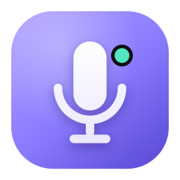

<p align="center">
  
</p>

<h1 align="center">Hush</h1>

<p align="center"><strong>Mute Discord while you dictate with Wispr Flow.</strong></p>

<p align="center">
  <a href="https://matthysdev.github.io/hush/">Website</a> ·
  <a href="#install">Install</a> ·
  <a href="#how-it-works">How it works</a> ·
  <a href="https://github.com/MatthysDev/hush/releases">Releases</a>
</p>

---

Hush is a tiny macOS menu-bar app. You already hold a push-to-talk shortcut to
dictate with **Wispr Flow** — but on a Discord call, everyone hears you. Hush
watches that **same shortcut** and **mutes your Discord mic** while it's held;
release it and your mic comes back. No more broadcasting your dictation to a
whole call.

- **Mutes Discord over RPC**, not a fake keystroke — the approach that actually works.
- **One shortcut — the one you already use.** Hush never simulates keys: you press
  your Wispr shortcut yourself, Hush just mutes Discord alongside it.
- **Menu-bar only** (`LSUIElement`), local & private, MIT-licensed.
- **Modes** — `hold` (push-to-talk) or `toggle`.

## Install

```bash
brew install --cask matthysdev/hush/hush
```

> ⚠️ Hush isn't notarized by Apple (free & open-source). The cask clears the
> quarantine flag for you; if macOS still complains, right-click the app →
> **Open**, or run `xattr -dr com.apple.quarantine /Applications/Hush.app`.

You'll need **Discord** (desktop) and **Wispr Flow** for the full bridge.

> **Windows?** Not yet. The core (global key detection, Discord RPC) is portable,
> but everything around it is macOS-specific today — TCC permissions, the menu-bar
> integration, the `.dmg`/Homebrew packaging. A Windows port is possible but is a
> separate piece of work.

## Setup

1. **Permission** — grant **Input Monitoring** (and Accessibility if prompted) so
   Hush can see when your shortcut is held. The settings window links straight to
   the right System Settings pane. That's the only thing Hush watches.
2. **Connect Discord** — Hush mutes Discord through its local RPC socket, which
   needs a free Discord app:
   - Go to <https://discord.com/developers/applications> → **New Application**.
   - **OAuth2** → copy the **Client ID** and a **Client Secret**.
   - **OAuth2 → Redirects** → add `http://localhost` → **Save Changes**.
     *(Required — without it the connection fails with "Missing redirect_uri".)*
   - Paste the Client ID & Secret into Hush → **Connect**. Approve the popup in
     Discord.
3. **Set your shortcut** — enter the **exact same** push-to-talk shortcut you use in
   Wispr Flow (Wispr → Settings → General → Shortcuts). Hush mirrors it and mutes
   Discord whenever it's held.

The built-in onboarding tutorial walks you through all of this on first launch.

## How it works

Hush's one job: **while you hold your push-to-talk shortcut, mute your Discord mic;
unmute on release.** You keep pressing the shortcut yourself — Wispr Flow responds
to it natively — and Hush runs in parallel.

Two facts shape the design:

- **Discord ignores synthesized keystrokes.** Every "just press Discord's mute
  hotkey for the user" approach fails, because Discord honors a real keypress but
  drops injected ones. So Hush skips keystrokes entirely and calls
  `SET_VOICE_SETTINGS { mute }` over Discord's own RPC/IPC socket — the mute lands
  every time.
- **Wispr already listens for your shortcut.** There's no reason for Hush to
  re-send it. Hush just needs to *know* when you're holding it, which it reads from
  a global keyboard listener (`uiohook-napi`) — no key injection anywhere.

That's the whole trick: **detect the shortcut, mute Discord over RPC.** Because
nothing is synthesized, there are no leaked modifiers, no self-observation loops,
and no keystrokes for anything to ignore.

## Architecture

```
src/
├── main.ts          # Electron entry: tray, settings window, IPC, permissions, wiring
├── orchestrator.ts  # State machine: shortcut down → mute Discord / up → unmute (serialized)
├── discord-mute.ts  # Discord muting over RPC (SET_VOICE_SETTINGS) — best-effort
├── input-engine.ts  # uiohook-napi global keyboard listener → shortcut detection
├── combo.ts         # Combo normalization, equality, display labels
├── config.ts        # Defaults + validation
├── store.ts         # Persisted config (electron-store) + migration from old configs
├── brand.ts         # Name, taglines, color palette
├── debug.ts         # Opt-in debug logging
├── preload.ts       # contextBridge IPC surface for the settings window
└── types.ts         # Shared types (Combo, Mode, HushConfig, DiscordMuter, …)

renderer/            # Settings window + onboarding tutorial (plain HTML/CSS/JS)
tests/               # vitest unit tests (orchestrator, discord-mute, trigger-detector, config)
assets/              # Icons (SVG source + generated PNGs + tray templates)
docs/                # Landing page (GitHub Pages)
Casks/hush.rb        # Homebrew cask (publish to the MatthysDev/homebrew-hush tap)
```

The core logic is unit-tested against fakes — the `Orchestrator`, `DiscordRpcMuter`,
`TriggerDetector` and combo/config helpers all have deterministic tests (no OS, no
real keyboard, no Discord).

## Config

Defaults live in `src/config.ts` and are persisted via `electron-store`:

| Setting         | Default | Meaning                                              |
| --------------- | ------- | ---------------------------------------------------- |
| `shortcut`      | `⌃⌥`    | Your push-to-talk shortcut (same as in Wispr Flow)   |
| `discordRpc`    | `{ }`   | Discord app Client ID & Secret (for RPC)             |
| `mode`          | `hold`  | `hold` (push-to-talk) or `toggle`                    |
| `unmuteDelayMs` | `0`     | Delay before unmuting Discord on release             |

## Develop

```bash
npm install
npm run build       # tsc → dist/
npm test            # vitest
npm start           # build + launch Electron
npm run dist        # build an (unsigned) .dmg via electron-builder
```

Prefer `scripts/install-local.sh` over `npm start` for day-to-day use: it signs
with a stable Apple Development identity and installs into `/Applications`, so the
macOS TCC grants (Input Monitoring / Accessibility) survive rebuilds.

## Release & Homebrew

1. `git tag v0.1.0 && git push --tags` → the **Release** workflow builds the DMG and
   attaches it (plus its SHA-256) to a GitHub Release.
2. Copy the printed `sha256` into `Casks/hush.rb`, bump `version`, and push the cask
   to your tap repo **`MatthysDev/homebrew-hush`** (`Casks/hush.rb`).
3. Users install with `brew install --cask matthysdev/hush/hush`.

The website lives in `docs/` and is served by GitHub Pages
(Settings → Pages → *main /docs*).

## License

MIT © Matthys Ducrocq
